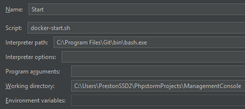
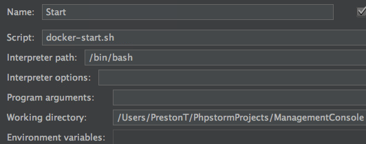

# SMU Arcade Machine Management Console

VK7JG-NPHTM-C97JM-9MPGT-3V66T

## Installation Steps
1. Install Git: [Git Download](https://git-scm.com/download)
2. Download Docker
    1. Windows 10 Professional, Enterprise, Education (Using HyperV - Fast - Desired way) - Activation key: VK7JG-NPHTM-C97JM-9MPGT-3V66T
        1. Install [Docker for Windows](https://download.docker.com/win/stable/InstallDocker.msi)
        2. Run 
        
            
        3. Make sure the Docker program is running.
        
            
        4. **Right click the Docker process -> Settings -> Shared Drives -> Select C drive to share**
    2. Windows 10 Home, Mobile, Mobile Enterprise (Using VM - Slow)
        1. Install [Docker Toolbox](https://github.com/docker/toolbox/releases/download/v1.12.0/DockerToolbox-1.12.0.exe)
        2. Run (Auto configures Docker settings)
        
            
    3. Mac - 2010 or newer model (Most users)
        1. Make sure your OS is at OS X 10.10.3 Yosemite or newer
        2. Install [Docker for Mac](https://download.docker.com/mac/stable/Docker.dmg)
        3. Make sure the Docker program is running.
                
            
    4. Mac - pre 2010
        1. Install [Docker Toolbox](https://github.com/docker/toolbox/releases/download/v1.12.0/DockerToolbox-1.12.0.pkg)
        2. Run (Auto configures Docker settings - Run everytime you startup the Docker containers)
        
            
3. Create a Docker Cloud account: [Docker Cloud](https://cloud.docker.com/)
4. Download PhpStorm (IDE): [PHP Storm](https://www.jetbrains.com/phpstorm/download/)
    1. Sign up under a student license.
    2. Click `Checkout from version control` under main screen to pull in this repo.
    3. Wait till it's done indexing.
    3. Open the docker-start.sh file | click Install plugins | Restart PHPStorm
    4. Run | Edit Configurations | For all 3 bash builds update the Interpreter & Working Directory accordingly | Apply | Ok
        1. Windows: C:\Program Files\Git\bin\bash.exe
        
        2. Mac: /bin/bash
        
    
5. Start Docker (first time takes a bit): 
    1. Make sure the Docker for Windows, Docker for Mac, or Docker Quickstart Terminal process is running
    2. Run Docker build
    
        
        * or
        * Click Terminal in PHPStorm (make sure `View | Tool Buttons` is checked), bottom left hand | `bash docker-start.sh` or `sh docker-start.sh`
        
    
6. Access public frontend EmberJS website: [http://localhost:4200/](http://localhost:4200/)
7. Access backend server: [http://localhost:8080/](http://localhost:8080/)
    1. Ex. [http://localhost:8080/test](http://localhost:8080/test)
8. Run Kitematic to visualize the containers and see logs
    
## Ember Guide
* Where to start learning: [Ember Tutorial](https://guides.emberjs.com/v2.8.0/tutorial/ember-cli/#toc_directory-structure)
* Make sure you are looking at guides/Stack Overflow questions for Ember 2.8.0 and up as Ember has changed a lot from 1.* -> 2.*. 
* **AJAX/Talking with the backend** - 2 ways
    1. [Ember Data](https://guides.emberjs.com/v2.8.0/tutorial/ember-data/)
        1. Used most of the time
        2. Used to POST, GET, and PUT resources (Ex. GET a list of all the ROMs)
        3. Basically a client side database that caches, updates, and adds new resources.
    2. [Ember AJAX](https://github.com/ember-cli/ember-ajax)
        1. Used rarely
        2. Try to use Ember Data whenever possible

## Run Settings
   
* Start - run Docker containers
* Remove Containers - remove all containers
* Remove All - remove all images and containers

## Helpful Commands
* SSH into Ember container (adding addons, adding bower components, adding Node modules):
    1. docker exec -it ember /bin/bash
* SSH into PHP/Apache container (read error logs):
    1. docker exec -it php-apache /bin/bash
* SSH into MySQL container:
    1. docker exec -it mysql /bin/bash
* Remove all containers and images:
    1. bash docker_files/docker-remove-all.sh
* Remove all containers:
    1. bash docker_files/docker-remove-containers.sh

# TODO/Bugs
* Test XDebug
* Codeigniter Rewrite